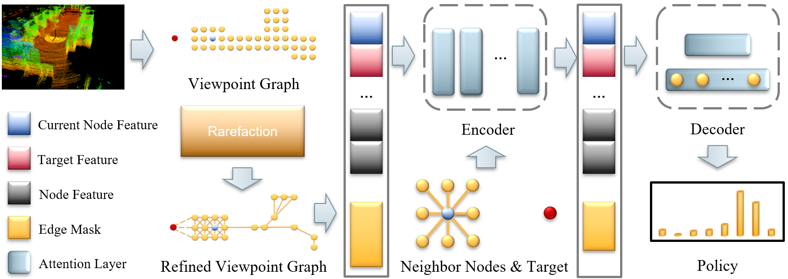
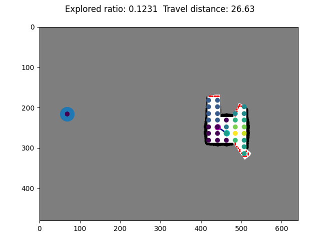
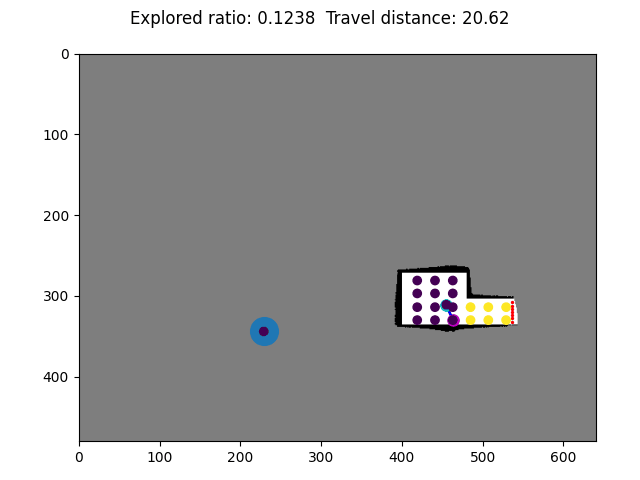

# Context_Aware_Navigation
### Public code and datasets for <a href="https://openreview.net/pdf?id=kSXh83gWWy">Context-Aware Deep Reinforcement Learning for Autonomous Robotic Navigation in Unknown Area</a>, which has been accepted for presentation at the 7th Conference on Robot Learning (CoRL 2023).

we propose a learning-based framework for autonomous navigation in unknown areas, which employs a context-aware policy network to achieve efficient decision-making (i.e., maximize the likelihood of finding the shortest route towards the target destination). Our agent learns a reactive policy over the next waypoint to travel to, in a constantly expanding graph over the agent’s partial map of the environment. We rely on an attention-based neural network to allow the agent to reason about its entire belief at multiple spatial scales, and form a context embedding, which it then uses to sequence local movement decisions informed by long-term objectives.
<center class="half">
    
</center>

## Demos

<div style="text-align: center;">
   
</div>

## Run
### Files
* `parameters.py` - Training parameters.
* `driver.py` - Driver of training program, maintain & update the global network.
* `runner.py` - Wrapper of the local network.
* `worker.py` - Interact with the environment and collect episode experience.
* `model.py` - Define attention-based network.
* `env.py` - Autonomous navigation environments.
* `graph_generator.py` - Generate and update the partial robot belief.
* `node.py` - Initialize and update nodes in the partial robot belief.
* `sensor.py` - Simulate the sensor model of Lidar.
* `/model` - Trained model.
* `/DungeonMaps` - Training environments.
### Main Dependencies
* `python == 3.10.8`
* `pytorch == 1.12.0`
* `ray == 2.1.0`
* `scikit-image == 0.19.3`
* `scikit-learn == 1.2.0`
* `scipy == 1.9.3`
* `matplotlib == 3.6.2`
* `tensorboard == 2.11.0`
### Training
1. Set training parameters in `parameters.py`.
2. Run `python driver.py`
### Evaluation
1. Set test parameters in `test_parameters.py`.
2. Run `python test_driver.py`

## Citation
If you find our work helpful or enlightening, feel free to cite our paper:
```
@inproceedings{liang2023context,
  title={Context-Aware Deep Reinforcement Learning for Autonomous Robotic Navigation in Unknown Area},
  author={Liang, Jingsong and Wang, Zhichen and Cao, Yuhong and Chiun, Jimmy and Zhang, Mengqi and Sartoretti, Guillaume Adrien},
  booktitle={Conference on Robot Learning},
  pages={1425--1436},
  year={2023},
  organization={PMLR}
}
```
## Authors
[Jingsong Liang](https://github.com/JingsongLiang),
[Zhichen Wang](), 
[Yuhong Cao](https://github.com/caoyuhong001), 
[Jimmy Chiun](), 
[Mengqi Zhang](), 
[Guillaume Sartoretti](https://github.com/gsartoretti)
